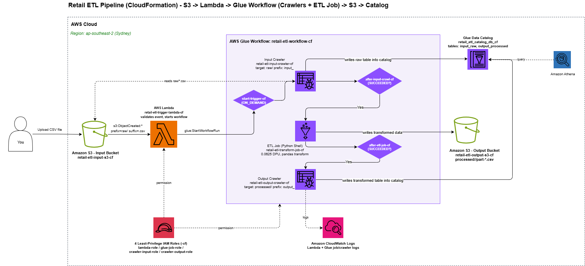
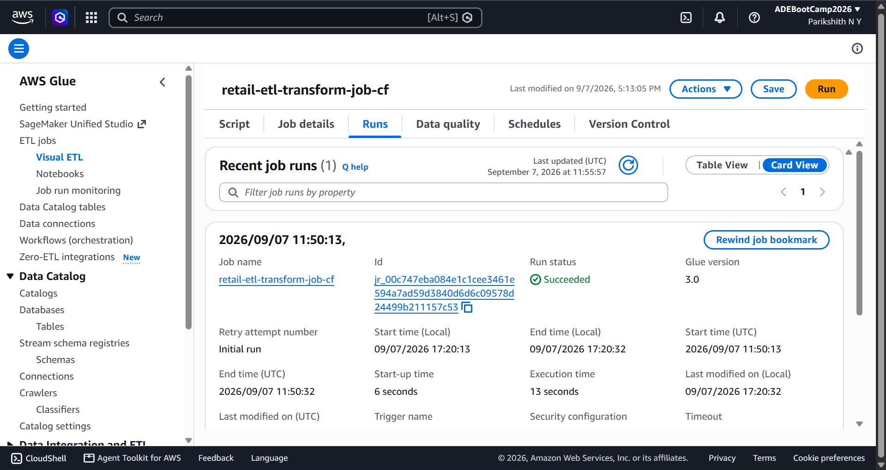
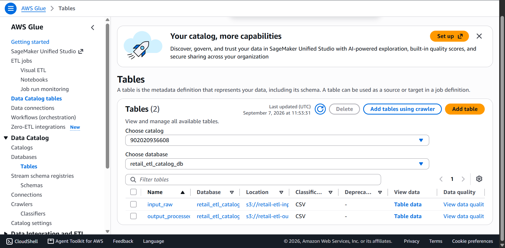
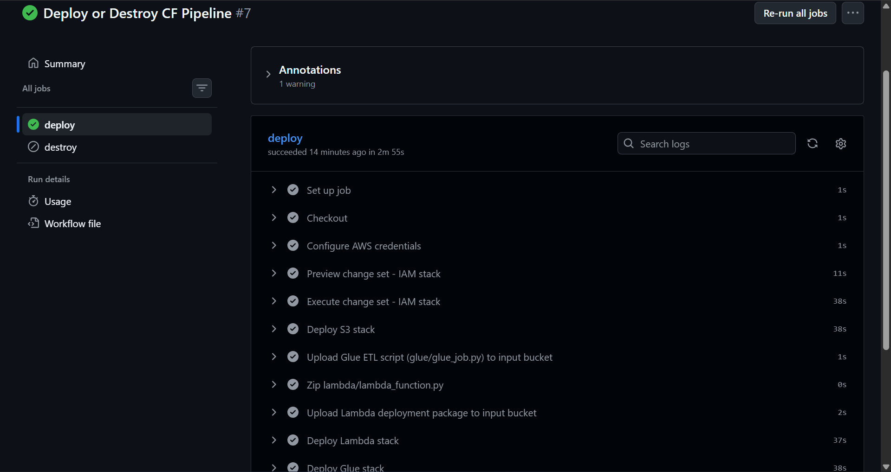
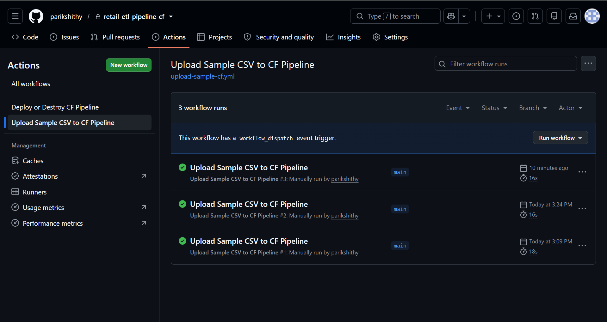
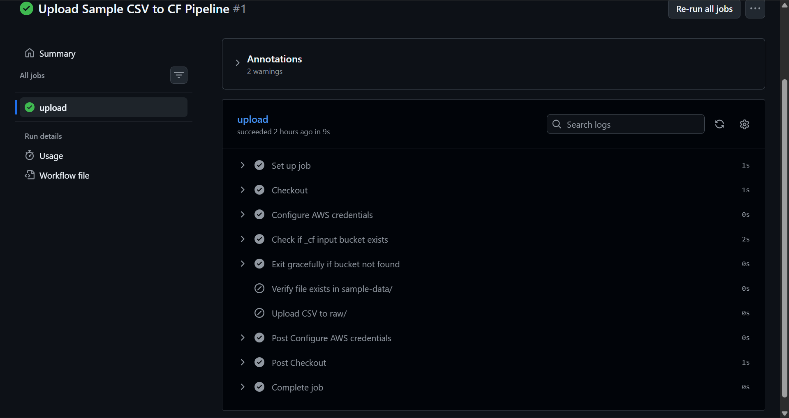

# Retail ETL Pipeline — CloudFormation

Event-driven AWS data pipeline: dropping a CSV into an S3 bucket automatically catalogs it, transforms it, and catalogs the result — with no servers, no polling, and no manual intervention after upload.

```
Upload CSV to S3 raw/
        ↓
S3 ObjectCreated notification
        ↓
Lambda (validates file, starts the Glue WORKFLOW)
        ↓
Glue Workflow "retail-etl-workflow-cf":
   ON_DEMAND trigger (started by Lambda)
        ├──> retail-etl-input-crawler-cf    (catalogs raw/ input data)
        └──> retail-etl-transform-job-cf     (Python Shell / pandas transform)
                     ↓ (on job SUCCESS)
             retail-etl-output-crawler-cf    (catalogs processed/ output data)
        ↓
Glue Data Catalog database: retail_etl_catalog_db
   ├── input_raw        (schema of the raw CSVs)
   └── output_processed  (schema of the transformed CSVs)
        ↓
Queryable via Amazon Athena
```

## Repository Structure

```
retail-etl-pipeline-cf/
├── .github/
│   └── workflows/
│       ├── deploy-destroy-cf.yml     # manual: deploy or destroy all _cf stacks
│       └── upload-sample-cf.yml      # manual: upload one sample CSV to trigger the pipeline
│
├── cloudformation/
│   ├── iam-stack.yaml                # 4 least-privilege IAM roles + inline policies
│   ├── s3-stack.yaml                 # input + output S3 buckets
│   ├── lambda-stack.yaml             # trigger Lambda function + S3 invoke permission
│   └── glue-stack.yaml               # Catalog database, ETL job, 2 crawlers, workflow + triggers
│
├── glue/
│   └── glue_job.py                   # Glue Python Shell ETL script (pandas transform)
│
├── lambda/
│   └── lambda_function.py            # Lambda source, packaged into a zip and deployed from S3
│
├── sample-data/
│   └── sample.csv
│
├── docs/
│   ├── architecture-diagram.png
│   └── screenshots/
│       ├── 01-lambda-cloudwatch-logs.png
│       ├── 02-glue-workflow-run-succeeded.png
│       ├── 03-glue-catalog-tables.png
│       ├── 04-athena-query-result.png
│       ├── 05-s3-output-processed.png
│       └── 06-github-actions-deploy-run.png
│
├── README.md
└── .gitignore
```

---

## Architecture Overview

| Stage | Service                         | Responsibility                                                                                                                                                              |
| ----- | ------------------------------- | --------------------------------------------------------------------------------------------------------------------------------------------------------------------------- |
| 1     | **S3 (input bucket)**           | Receives raw CSVs under`raw/`; stores the Glue ETL script under`scripts/`and the packaged Lambda code under`lambda-packages/`.                                              |
| 2     | **S3 Event Notification**       | Fires on`s3:ObjectCreated:*`for keys matching prefix`raw/`and suffix`.csv`.                                                                                                 |
| 3     | **Lambda**                      | Validates the event (correct prefix, correct extension, non-zero size) and starts the Glue**workflow**, passing the exact input/output S3 paths as workflow run properties. |
| 4     | **Glue Workflow**               | Orchestrates three steps in order: crawl input → run ETL job → crawl output.                                                                                                |
| 5     | **Glue Crawler (input)**        | Scans`raw/`and registers/updates a table in the Data Catalog reflecting the raw CSV schema.                                                                                 |
| 6     | **Glue ETL Job (Python Shell)** | Reads the raw CSV(s) with pandas, uppercases`customer_name`, adds a`discounted_amount`column (10% off`amount`), and writes the result to the output bucket.                 |
| 7     | **Glue Crawler (output)**       | Scans`processed/`and registers/updates a table reflecting the transformed CSV schema.                                                                                       |
| 8     | **Glue Data Catalog**           | Holds both tables, queryable from Athena or any other Catalog-aware service.                                                                                                |



## AWS Resources — Full Breakdown

### S3 Buckets

Two separate buckets, one per direction of data flow — this keeps permissions simpler (a role that reads `raw/` never needs to be trusted with `processed/`, and vice versa) and makes it obvious at a glance which bucket represents pipeline input versus pipeline output.


| Bucket                    | Purpose                                                                  | Key prefixes used                                                                     |
| ------------------------- | ------------------------------------------------------------------------ | ------------------------------------------------------------------------------------- |
| `retail-etl-input-s3-cf`  | Landing zone for uploads, the Glue script, and the packaged Lambda code. | `raw/`(incoming CSVs),`scripts/`(glue_job.py),`lambda-packages/`(lambda_function.zip) |
| `retail-etl-output-s3-cf` | Destination for transformed data.                                        | `processed/<basename>/`(one`part-*.csv`per pipeline run)                              |

Both buckets are configured identically:

- **Block Public Access** — all four settings enabled (no public ACLs, no public bucket policies, all public access ignored/restricted). Neither bucket ever needs to serve content publicly.
- **Server-side encryption** — SSE-S3 (`AES256`), Amazon's own managed keys. No KMS key is used, since KMS carries a small per-request cost and this POC has no requirement for customer-managed keys or key rotation policies.
- **Versioning** — left in a default/suspended state. Versioning was deliberately not enabled: for a POC that repeatedly uploads and deletes test files, keeping old versions around would silently grow storage costs and complicate bucket deletion (a bucket with any version history, including leftover delete markers, cannot be deleted until every version is explicitly removed).
- **Lifecycle rule** — aborts incomplete multipart uploads after 7 days. Large or interrupted uploads can otherwise leave partial data sitting in S3, billed as storage, with no object visible in the console to warn you it's there.
- **Tags** — `Project: retail-etl-pipeline`, so all cost tracking in Cost Explorer / Budgets can be filtered down to exactly this project's resources.

### IAM Roles and Policies (least privilege)

Four separate roles, each trusted by exactly one AWS service and scoped to exactly the actions and resources that service needs for this pipeline — no role has access to a resource its job doesn't require, and no role is shared between services.


| Role                    .                | Trusted by                  . | Purpose                                                                                                                       |
| ---------------------------------------- | ----------------------------- | ----------------------------------------------------------------------------------------------------------------------------- |
| `retail-etl-lambda-role-cf`              | `lambda.amazonaws.com`        | Start the Glue workflow; write its own CloudWatch logs.                                                                       |
| `retail-etl-glue-job-role-cf`            | `glue.amazonaws.com`          | Read`raw/*`and`scripts/*`from the input bucket, write`processed/*`to the output bucket, read the workflow's run properties.   |
| `retail-etl-glue-crawler-input-role-cf`  | `glue.amazonaws.com`          | Read-only access to`raw/*`in the input bucket, plus Glue's own Catalog-write permissions (from the AWS-managed policy below). |
| `retail-etl-glue-crawler-output-role-cf` | `glue.amazonaws.com`          | Read-only access to`processed/*`in the output bucket, plus the same Catalog-write permissions.                                |

Each role attaches **one AWS-managed policy** for baseline service functionality, plus **one customer-managed inline policy** scoped to this project's exact resource ARNs:

| Role          | AWS-managed policy            | What it adds                                                                                                                                                                 |
| ------------- | ----------------------------- | ---------------------------------------------------------------------------------------------------------------------------------------------------------------------------- |
| Lambda        | `AWSLambdaBasicExecutionRole` | Permission to create its own CloudWatch log group/stream and write log events — nothing else.                                                                                |
| Glue job      | `AWSGlueServiceRole`          | Baseline Glue service permissions (its own logging, and limited default Glue actions) — it does**not**grant any S3 access; all S3 access comes from the inline policy below. |
| Both crawlers | `AWSGlueServiceRole`          | Same baseline, plus this is what actually allows a crawler to write tables into the Data Catalog and log its runs.                                                           |

Customer-managed inline policies, statement by statement:

**`retail-etl-lambda-policy-cf`**

```json
{
  "Sid": "StartGlueWorkflowOnly",
  "Effect": "Allow",
  "Action": "glue:StartWorkflowRun",
  "Resource": "arn:aws:glue:ap-southeast-2:<account-id>:workflow/retail-etl-workflow-cf"
}
```

Lambda can start _only_ this one named workflow. It cannot start any other Glue job or workflow in the account, and it cannot stop, delete, or modify the workflow — only trigger a run of it.

**`retail-etl-glue-job-policy-cf`**

```json
{
  "Sid": "ListInputBucket",        "Action": "s3:ListBucket",  "Resource": "arn:aws:s3:::retail-etl-input-s3-cf" },
{ "Sid": "ReadInputAndScripts",    "Action": "s3:GetObject",   "Resource": ["...input-s3-cf/raw/*", "...input-s3-cf/scripts/*"] },
{ "Sid": "ListOutputBucket",       "Action": "s3:ListBucket",  "Resource": "arn:aws:s3:::retail-etl-output-s3-cf" },
{ "Sid": "WriteProcessedOutput",   "Action": ["s3:PutObject","s3:GetObject"], "Resource": "...output-s3-cf/processed/*" },
{ "Sid": "ReadWorkflowRunProperties", "Action": ["glue:GetWorkflowRunProperties","glue:GetWorkflowRun"], "Resource": "...workflow/retail-etl-workflow-cf" }
```

The job can read only from `raw/` and `scripts/` in the input bucket, write only to `processed/` in the output bucket, and read (never modify) the workflow's own run properties — which is how it discovers which specific input/output paths apply to the run it's currently executing inside.

**`retail-etl-crawler-input-policy-cf`**

```json
{ "Sid": "ListInputBucket", "Action": "s3:ListBucket", "Resource": "arn:aws:s3:::retail-etl-input-s3-cf" },
{ "Sid": "ReadRawData",     "Action": "s3:GetObject",  "Resource": "...input-s3-cf/raw/*" }
```

Read-only, and only inside `raw/` — this crawler can never see `scripts/` or anything in the output bucket.

**`retail-etl-crawler-output-policy-cf`**

```json
{ "Sid": "ListOutputBucket",     "Action": "s3:ListBucket", "Resource": "arn:aws:s3:::retail-etl-output-s3-cf" },
{ "Sid": "ReadProcessedData",    "Action": "s3:GetObject",  "Resource": "...output-s3-cf/processed/*" }
```

Symmetric to the input crawler's policy, scoped to the output bucket and the `processed/` prefix only.


### AWS Lambda

**Function:**`retail-etl-trigger-lambda-cf`**Runtime:** Python 3.12 **Timeout:** 30 seconds **Trigger:** S3 `ObjectCreated:*` events on the input bucket, filtered to `prefix = raw/`, `suffix = .csv`**Environment variable:**`GLUE_WORKFLOW_NAME = retail-etl-workflow-cf`

What it does, in order:

1. Parses the S3 event record (bucket name, object key, object size), URL-decoding the key since S3 event keys can be percent-encoded.
2. **Validates** the upload:
   - Ignores anything outside `raw/`.
   - Ignores anything that doesn't end in `.csv` (case-sensitive).
   - Ignores zero-byte objects.

   Any of these simply returns a `200` with an explanatory message — they are not treated as errors, since receiving an event for a file this pipeline doesn't care about is expected, normal behavior.

3. Builds the exact `s3://` input path for the uploaded file, and a corresponding output path `s3://retail-etl-output-s3-cf/processed/<basename>/`.
4. Calls `glue.start_workflow_run()`, passing both paths as **workflow run properties** (`INPUT_PATH`, `OUTPUT_PATH`) — this is necessary because `start_workflow_run` has no equivalent of a Glue job's `--arguments`; run properties are the workflow-level mechanism for passing data into the jobs a workflow will run.
5. Returns the `RunId` on success, or re-raises any unexpected AWS error after logging it (so the failure is visible in CloudWatch and in the Lambda's own execution status).

Deployment mechanics: the function's code lives at `lambda/lambda_function.py` in this repo. The deploy workflow zips that single file and uploads it to `s3://retail-etl-input-s3-cf/lambda-packages/lambda_function.zip`, then deploys `lambda-stack.yaml` with that bucket/key passed in as CloudFormation parameters — the template itself never embeds the function's source code, keeping the code reviewable as an ordinary `.py` file rather than buried inside YAML.


### AWS Glue — ETL Job (Python Shell)

**Job:**`retail-etl-transform-job-cf`**Job type:** Python Shell (not Spark) **Python version:** 3.9 **DPU allocation:**`0.0625` (1/16 DPU — the smallest size Glue offers) **Max retries:** 0 **Timeout:** 10 minutes **Max concurrent runs:** 1

Python Shell was chosen deliberately over Spark: the CSVs this pipeline handles are small, so a lightweight pandas script that starts in seconds and runs on a fraction of a DPU is both cheaper and faster than spinning up a Spark cluster for the same work. Spark's advantage — distributed processing across large datasets — isn't needed here.

The script (`glue/glue_job.py`) does the following:

1. Reads `WORKFLOW_NAME` and `WORKFLOW_RUN_ID` — the two arguments Glue automatically injects into any job that runs as part of a workflow.
2. Calls `glue.get_workflow_run_properties()` to fetch the `INPUT_PATH` / `OUTPUT_PATH` values that Lambda set when it started this specific workflow run.
3. Resolves the input path into a list of one or more CSV object keys (a single file, or every CSV under a prefix).
4. Reads all matching CSVs into a single pandas DataFrame.
5. Drops fully-empty rows.
6. Uppercases the `customer_name` column.
7. Adds a `discounted_amount` column: `amount * 0.90`, rounded to 2 decimal places using standard half-up rounding.
8. Writes the result to the output path as a new `part-<uuid>.csv` object — a new file per run, so earlier output is never overwritten or lost.

Because the job only ever runs **inside** the workflow (it has no standalone trigger or schedule of its own), it always receives `WORKFLOW_NAME`/`WORKFLOW_RUN_ID` and never needs a fallback path for being invoked without them.



### AWS Glue — Crawlers

Two crawlers, one per bucket, each writing into the same shared Catalog database but under a distinct table-name prefix so the two schemas never collide.

| Crawler                        | Target path                               | Table prefix | Role used                                |
| ------------------------------ | ----------------------------------------- | ------------ | ---------------------------------------- |
| `retail-etl-input-crawler-cf`  | `s3://retail-etl-input-s3-cf/raw/`        | `input_`     | `retail-etl-glue-crawler-input-role-cf`  |
| `retail-etl-output-crawler-cf` | `s3://retail-etl-output-s3-cf/processed/` | `output_`    | `retail-etl-glue-crawler-output-role-cf` |

Both crawlers:

- Are **on-demand only** — no schedule. They are exclusively started by the workflow's triggers, never by a timer, so no crawl ever runs when there's no new data to catalog.
- Use `SchemaChangePolicy: UpdateBehavior = UPDATE_IN_DATABASE`, `DeleteBehavior = LOG` — if the shape of the CSV changes between runs, the existing table's schema is updated in place (not replaced with a brand-new table), and if data disappears from S3, the crawler only logs that fact rather than silently deleting Catalog metadata.
- Re-running a crawler against the same S3 location always updates the _same_ table rather than creating a new one each time — the table identity is tied to the target path and prefix, not to the crawler run itself.
- 

### AWS Glue — Data Catalog Database

**Database:**`retail_etl_catalog_db`

A single shared database holds both tables this pipeline produces:

- `input_raw` — schema of the raw uploaded CSVs (as discovered by the input crawler).
- `output_processed` — schema of the transformed CSVs, including the new `discounted_amount` column (as discovered by the output crawler).

Both tables are immediately queryable from **Amazon Athena** by selecting this database — no additional Athena-specific setup is required beyond having at least one successful crawl of each source.



### AWS Glue — Workflow and Triggers

**Workflow:**`retail-etl-workflow-cf`

The workflow strings together the crawlers and the ETL job into a single orchestrated sequence, using three triggers:

```
start-trigger-cf            (ON_DEMAND — started externally by Lambda)
        │
        ▼
retail-etl-input-crawler-cf
        │
        ▼
after-input-crawl-cf         (CONDITIONAL — fires when the input crawler's
        │                     CrawlState == SUCCEEDED)
        ▼
retail-etl-transform-job-cf
        │
        ▼
after-etl-job-cf             (CONDITIONAL — fires when the ETL job's
        │                     State == SUCCEEDED)
        ▼
retail-etl-output-crawler-cf
```

- The **start trigger** is the only entry point into the workflow — it's what Lambda's `start_workflow_run()` call actually activates. Nothing else in the workflow can be started independently from the outside.
- Both **conditional triggers** are created with `StartOnCreation: true` in the CloudFormation template — without this flag, Glue creates conditional triggers in a `DEACTIVATED` state by default, and they would never fire even though every other part of the workflow looks correctly wired.
- Each conditional trigger only proceeds on a `SUCCEEDED` predicate — if the input crawler fails, the ETL job never starts; if the ETL job fails, the output crawler never starts. A partial or broken run stops cleanly instead of cataloging incomplete or corrupt output.


## CloudFormation Stacks

Split into four stacks for clean separation of concerns, deployed in this fixed dependency order (later stacks import values the earlier ones export):

| Order | Stack name                   | Template                           | Exports used by later stacks  |
| ----- | ---------------------------- | ---------------------------------- | ----------------------------- |
| 1     | `retail-etl-iam-stack-cf`    | `cloudformation/iam-stack.yaml`    | 4 role ARNs                   |
| 2     | `retail-etl-s3-stack-cf`     | `cloudformation/s3-stack.yaml`     | bucket names/ARNs             |
| 3     | `retail-etl-lambda-stack-cf` | `cloudformation/lambda-stack.yaml` | Lambda function ARN/name      |
| 4     | `retail-etl-glue-stack-cf`   | `cloudformation/glue-stack.yaml`   | database, workflow, job names |

IAM must come first since both the Lambda and Glue stacks reference role ARNs the IAM stack exports. S3 comes next since the Glue script and the Lambda deployment package must be uploaded to the input bucket before the Lambda and Glue stacks can reference them. The S3 bucket **notification** that actually wires S3 → Lambda together is deliberately **not** defined inside either the S3 or Lambda template — putting it in either one would create a circular dependency between the two stacks (S3 needing Lambda's ARN, Lambda needing the bucket's ARN, both defined in the same direction). Instead, the notification is configured as a plain AWS CLI step in the deploy workflow, run only after both stacks already exist.


## CI/CD — GitHub Actions Workflows

### IAM User for CI/CD

A dedicated, API-only IAM user, `retail-etl-cicd-cf`, is used by GitHub Actions to run every `aws cloudformation` / `aws s3` command in both workflows. It is not a console user — it has no password, only programmatic access keys stored as GitHub repository secrets (`AWS_ACCESS_KEY_ID`, `AWS_SECRET_ACCESS_KEY`, `AWS_REGION`).

Its policy, `retail-etl-cicd-cf-policy`, is scoped as tightly as each underlying AWS API allows:

- **CloudFormation** — full stack lifecycle actions (`CreateStack`/`UpdateStack`/`DeleteStack`/change-set operations), restricted by resource ARN to stacks matching `retail-etl-*-cf` only. Account-level read actions that don't support resource-level restriction (`ValidateTemplate`, `ListStacks`, `ListExports`, `ListImports`) are granted with `Resource: "*"`, since AWS's IAM reference confirms these specific actions have no ARN-scoping option at all.
- **S3** — bucket lifecycle and object actions (create, tag, encrypt, version, notify, and read/write/delete objects and object versions), restricted to exactly the two `-cf` bucket ARNs and everything under them.
- **IAM** — role and policy lifecycle actions, restricted to `role/retail-etl-*-cf` and `policy/retail-etl-*-cf` ARN patterns only. This user can create or delete the pipeline's own roles, and nothing else in the account's IAM configuration.
- **Lambda** — function lifecycle actions, restricted to `function:retail-etl-*-cf`.
- **Glue** — database, job, crawler, workflow, and trigger lifecycle actions. Most of these are granted with `Resource: "*"` because a number of Glue APIs (`CreateDatabase`, `CreateTrigger`, `StopCrawler`, among others) simply do not support resource-level ARN restriction — this is a documented AWS limitation, not a design choice to grant broader access than necessary.

### Deploy / Destroy Workflow

**File:**`.github/workflows/deploy-destroy-cf.yml`**Trigger:** manual only (`workflow_dispatch`), with a required choice input: `deploy` or `destroy`.

**Deploy path**, in order:

1. Preview a change set for the IAM stack (`--no-execute-changeset`), then execute it — this is the one stack in the pipeline where a change-set preview step exists explicitly, since it's the stack most likely to need careful review (it grants permissions).
2. Deploy the S3 stack.
3. Upload `glue/glue_job.py` from the repo to `s3://retail-etl-input-s3-cf/scripts/glue_job.py`.
4. Zip `lambda/lambda_function.py` from the repo and upload it to `s3://retail-etl-input-s3-cf/lambda-packages/lambda_function.zip`.
5. Deploy the Lambda stack, passing that S3 bucket/key as parameters.
6. Deploy the Glue stack.
7. Configure the S3 → Lambda event notification via `aws s3api put-bucket-notification-configuration`, using the Lambda ARN pulled live from CloudFormation's exports.

**Destroy path**, in order (reverse of deploy):

1. Remove the S3 event notification.
2. Empty both buckets (`aws s3 rm --recursive`).
3. Delete the Glue stack, and wait for completion.
4. Delete the Lambda stack, and wait for completion.
5. Delete the S3 stack, and wait for completion.
6. Delete the IAM stack, and wait for completion.

Buckets must be emptied before their stack can be deleted — S3 refuses to delete a non-empty bucket, and CloudFormation surfaces that as a stack-level `DELETE_FAILED` if the bucket still holds any objects, including delete markers left behind from a bucket that has ever had versioning enabled or suspended.





### Upload Sample Workflow

**File:**`.github/workflows/upload-sample-cf.yml`**Trigger:** manual only (`workflow_dispatch`), with a `filename` text input (default: `sample.csv`).

Steps:

1. Runs `aws s3api head-bucket` against `retail-etl-input-s3-cf`. This is the cheapest possible existence check — a single HEAD request, no listing, no cost beyond a negligible API call.
2. If the bucket does **not** exist, the workflow prints a warning annotation ("No `_cf` resources found — deploy first.") and exits with success (not failure) — a missing bucket here just means "nothing to upload to yet," not an error condition.
3. If the bucket exists, verifies the requested file is actually present under `sample-data/` in the repo (catches a typo'd filename before attempting the upload).
4. Uploads the file to `raw/<filename>` in the input bucket — this single upload is what fires the entire chain: S3 notification → Lambda → Glue workflow → both crawlers.

This workflow is intentionally separate from the deploy/destroy workflow, and both are manual-only — there is no push-triggered automation in this repo. You choose exactly when infrastructure is created, when test data is sent through it, and when everything is torn down again.






## Setup Guide

1. **Create the CI/CD IAM user** (`retail-etl-cicd-cf`) and attach the `retail-etl-cicd-cf-policy` described above.
2. **Generate an access key** for that user (Use case: _Third-party service_).
3. **Add GitHub repository secrets**: `AWS_ACCESS_KEY_ID`, `AWS_SECRET_ACCESS_KEY`, `AWS_REGION` (`ap-southeast-2`).
4. **Run `deploy-destroy-cf.yml`** with `action: deploy`.
5. **Run `upload-sample-cf.yml`** with the default filename (or any file under `sample-data/`).
6. **Verify** the pipeline ran end-to-end (see checklist below).
7. **Run `deploy-destroy-cf.yml`** with `action: destroy` when you're done, to avoid any ongoing storage/logging cost.

## Data Transformation Logic

**Input**

```csv
sale_id,customer_name,product,quantity,amount,status
3001,John Smith,Laptop,1,850.00,COMPLETED
3003,David Kumar,Monitor,1,275.50,PENDING
```

**Output**

```csv
sale_id,customer_name,product,quantity,amount,status,discounted_amount
3001,JOHN SMITH,Laptop,1,850.0,COMPLETED,765.0
3003,DAVID KUMAR,Monitor,1,275.5,PENDING,247.95
```

Rules applied: drop fully-empty rows, uppercase `customer_name`, and add `discounted_amount` = `amount` less 10%, rounded to 2 decimal places using standard half-up rounding.

## What to Verify After a Deploy

- [ ] All 4 CloudFormation stacks show `CREATE_COMPLETE`.
- [ ] `scripts/glue_job.py` and `lambda-packages/lambda_function.zip` exist in the input bucket.
- [ ] Uploading a CSV to `raw/` produces a CloudWatch log entry from `retail-etl-trigger-lambda-cf` showing a `RunId`.
- [ ] The Glue workflow's **History** tab shows all three nodes (input crawler → ETL job → output crawler) as **Succeeded**.
- [ ] A transformed `part-*.csv` appears under `processed/<basename>/` in the output bucket.
- [ ] Both `input_raw` and `output_processed` tables exist in `retail_etl_catalog_db`.
- [ ] An Athena query against `output_processed` returns the transformed rows.

## Cost Controls

- Glue ETL job runs as a Python Shell job on `0.0625` DPU (the smallest available size).
- Glue job retries disabled; job timeout capped at 10 minutes.
- Both crawlers are on-demand only — no schedule, so they never run unless the workflow explicitly starts them.
- Lambda only runs when invoked by an S3 event.
- Incomplete multipart uploads are aborted after 7 days on both buckets.
- No EC2, NAT Gateway, or always-on compute of any kind.
- All resources are tagged `Project: retail-etl-pipeline` for Cost Explorer / Budgets filtering.
- A \$5/month AWS Budget alarm is configured on the account independently of this pipeline's own resources.

## Cleanup

Run **Deploy or Destroy CF Pipeline** with `action: destroy`. This empties both S3 buckets and deletes all four stacks in reverse dependency order. Confirm in the CloudFormation console that all four `-cf` stacks are gone, and that both `-cf` S3 buckets, all four `-cf` IAM roles, the Lambda function, both crawlers, the ETL job, the workflow, and the Catalog database no longer appear in their respective consoles.
