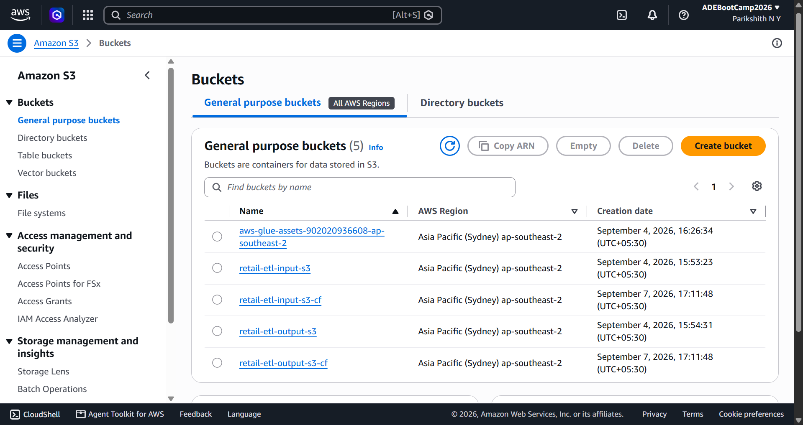
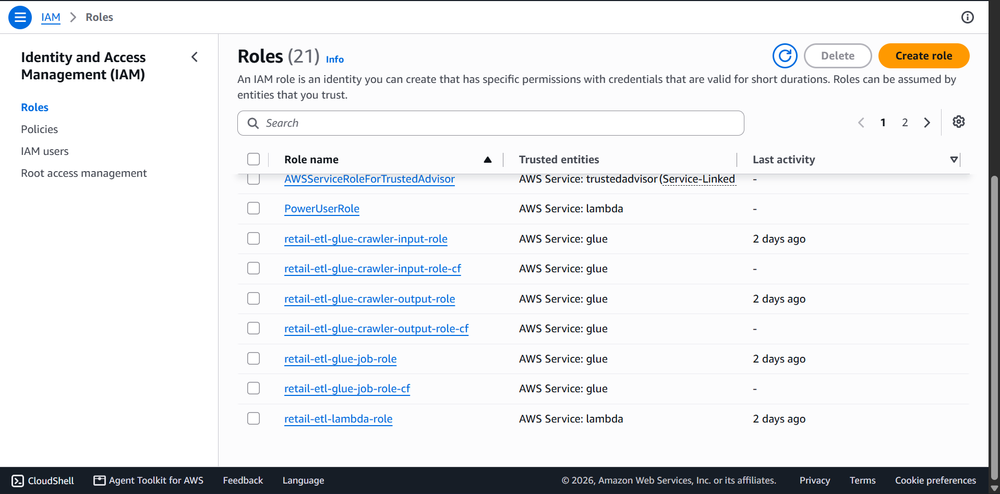
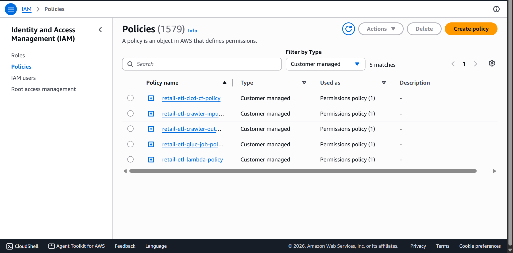
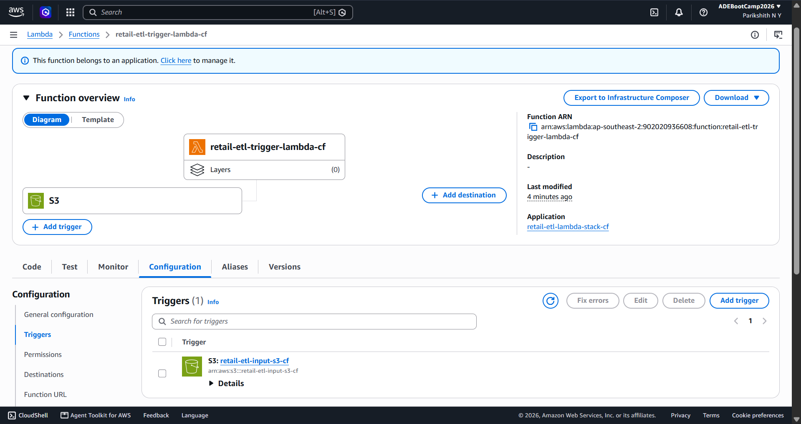
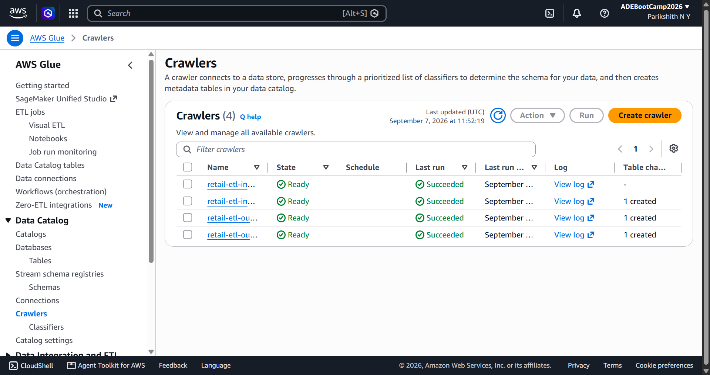
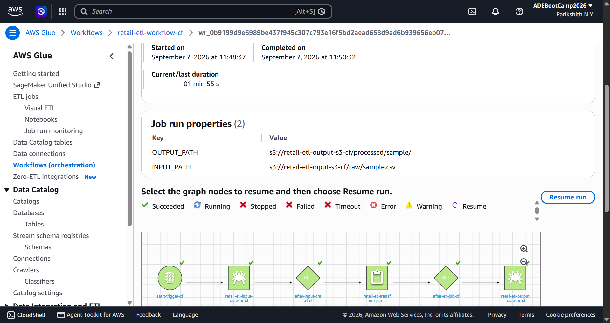
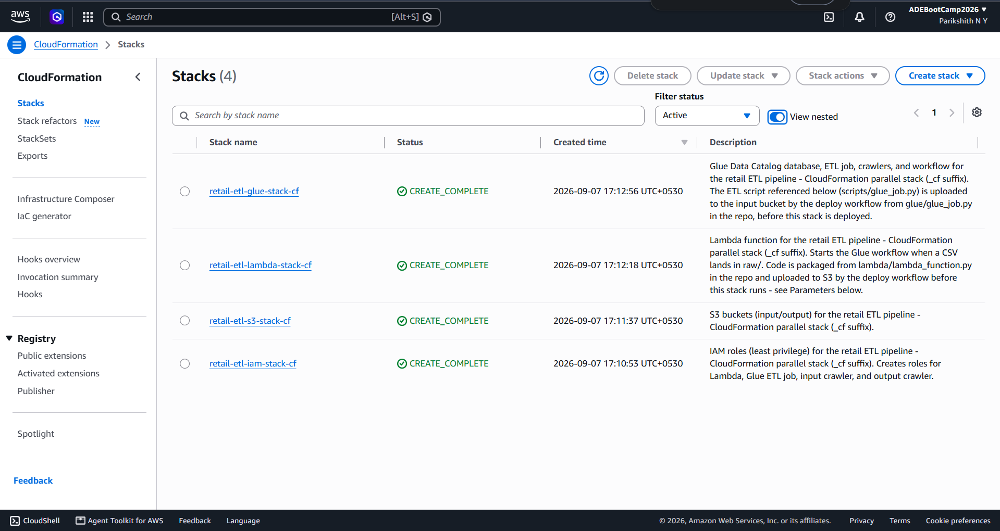
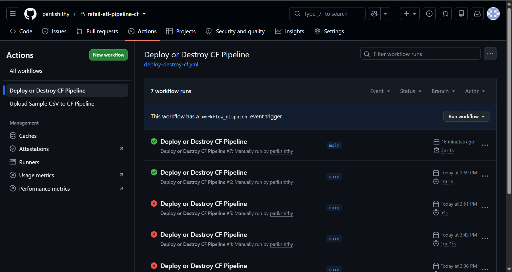
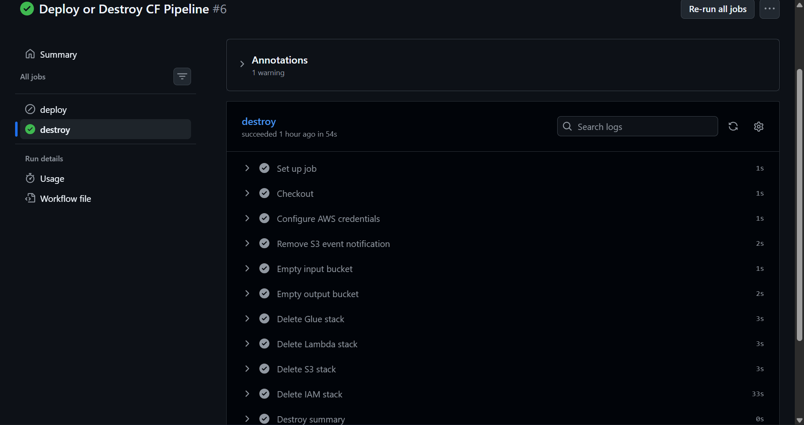
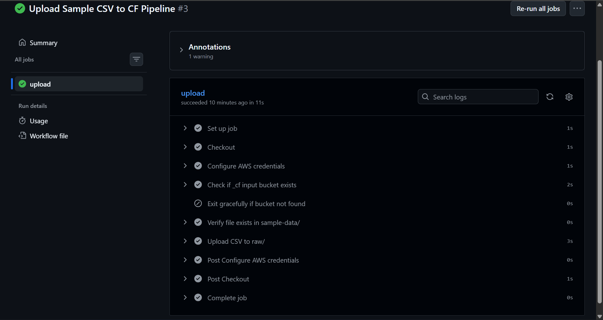

# Retail ETL Pipeline — CloudFormation

Event-driven AWS data pipeline: dropping a CSV into an S3 bucket automatically catalogs it, transforms it, and catalogs the result — with no servers, no polling, and no manual intervention after upload.

## Why everything here is suffixed `-cf` / `_cf`

Every resource in this project — buckets, roles, the Lambda, the Glue job, both crawlers, the workflow, the Catalog database — is named with a `-cf` suffix (or `_cf` where hyphens aren't allowed, e.g. database and table names). This exists so the CloudFormation-managed version of this pipeline can be deployed side-by-side with an earlier Terraform-based version of the same pipeline, in the same AWS account, with zero naming collisions between the two. If you're only ever going to run the CloudFormation version, the suffix has no functional purpose beyond that — it's a naming convention, not a technical requirement.

```
Upload CSV to S3 raw/
        ↓
S3 -> EventBridge (Object Created event)
        ↓
Lambda (validates file, starts the Glue WORKFLOW)
        ↓
Glue Workflow "retail-etl-workflow-cf":
   ON_DEMAND trigger (started by Lambda)
        ├──> retail-etl-input-crawler-cf    (catalogs raw/ input data)
        └──> retail-etl-transform-job-cf     (Python Shell / pandas transform)
                     ↓ (on job SUCCESS)
             retail-etl-output-crawler-cf    (catalogs processed/ output data)
        ↓
Glue Data Catalog database: retail_etl_catalog_db_cf
   ├── input_raw        (schema of the raw CSVs)
   └── output_processed  (schema of the transformed CSVs)
        ↓
Queryable via Amazon Athena
```

## Repository Structure

```
retail-etl-pipeline-cf/
├── .github/
│   └── workflows/
│       ├── deploy-destroy-cf.yml     # manual: deploy or destroy all _cf stacks
│       └── upload-sample-cf.yml      # manual: upload one sample CSV to trigger the pipeline
│
├── cloudformation/
│   ├── iam-stack.yaml                # 4 least-privilege IAM roles + inline policies
│   ├── s3-stack.yaml                 # input + output S3 buckets, EventBridge enabled
│   ├── lambda-stack.yaml             # trigger Lambda + EventBridge rule + permission
│   └── glue-stack.yaml               # Catalog database, ETL job, 2 crawlers, workflow + triggers
│
├── glue/
│   └── glue_job.py                   # Glue Python Shell ETL script (pandas transform)
│
├── lambda/
│   └── lambda_function.py            # Lambda source, packaged into a zip and deployed from S3
│
├── sample-data/
│   └── sample.csv
│
├── images/
│   └── README/                       # architecture diagram + console/workflow screenshots
│
├── README.md
└── .gitignore
```

---

## Architecture Overview

| Stage | Service                         | Responsibility                                                                                                                                                                                                           |
| ----- | ------------------------------- | ------------------------------------------------------------------------------------------------------------------------------------------------------------------------------------------------------------------------ |
| 1     | **S3 (input bucket)**           | Receives raw CSVs under`raw/`; stores the Glue ETL script under`scripts/`and the packaged Lambda code under`lambda-packages/`.                                                                                           |
| 2     | **EventBridge**                 | An S3-managed EventBridge notification fires an`Object Created`event whenever a new object lands in the input bucket; a rule filters this to keys under`raw/`and routes matching events to Lambda.                       |
| 3     | **Lambda**                      | Validates the event (correct prefix, correct extension, non-zero size) and starts the Glue**workflow**, passing the exact input/output S3 paths as workflow run properties.                                              |
| 4     | **Glue Workflow**               | Orchestrates three steps in order: crawl input → run ETL job → crawl output.                                                                                                                                             |
| 5     | **Glue Crawler (input)**        | Scans`raw/`and registers/updates a table in the Data Catalog reflecting the raw CSV schema.                                                                                                                              |
| 6     | **Glue ETL Job (Python Shell)** | Reads the raw CSV(s) with pandas, validates the schema, uppercases`customer_name`, adds a`discounted_amount`column (10% off`amount`), clears any prior output for this file, and writes the result to the output bucket. |
| 7     | **Glue Crawler (output)**       | Scans`processed/`and registers/updates a table reflecting the transformed CSV schema.                                                                                                                                    |
| 8     | **Glue Data Catalog**           | Holds both tables, queryable from Athena or any other Catalog-aware service.                                                                                                                                             |


## AWS Resources — Full Breakdown

### S3 Buckets

Two separate buckets, one per direction of data flow — this keeps permissions simpler (a role that reads `raw/` never needs to be trusted with `processed/`, and vice versa) and makes it obvious at a glance which bucket represents pipeline input versus pipeline output.

Bucket names include the AWS account ID (e.g. `retail-etl-input-s3-cf-<account-id>`), since S3 bucket names must be globally unique across every AWS account on Earth — a fixed name like `retail-etl-input-s3-cf` would only ever work for the first person who deployed this template, and would fail with `BucketAlreadyExists` for anyone else. The account ID suffix guarantees this template deploys cleanly in any account.



| Bucket                                 | Purpose                                                                  | Key prefixes used                                                                     |
| -------------------------------------- | ------------------------------------------------------------------------ | ------------------------------------------------------------------------------------- |
| `retail-etl-input-s3-cf-<account-id>`  | Landing zone for uploads, the Glue script, and the packaged Lambda code. | `raw/`(incoming CSVs),`scripts/`(glue_job.py),`lambda-packages/`(lambda_function.zip) |
| `retail-etl-output-s3-cf-<account-id>` | Destination for transformed data.                                        | `processed/<basename>/`(one current`part-*.csv`per source file)                       |

Both buckets are configured identically:

- **Block Public Access** — all four settings enabled. Neither bucket ever needs to serve content publicly.
- **Server-side encryption** — SSE-S3 (`AES256`), Amazon's own managed keys. No KMS key is used, since KMS carries a small per-request cost and this POC has no requirement for customer-managed keys or key rotation policies.
- **Versioning** — left in a default/suspended state, to avoid silently growing storage costs and to keep bucket deletion simple.
- **Lifecycle rule** — aborts incomplete multipart uploads after 7 days.
- **Tags** — `Project: retail-etl-pipeline`, so cost tracking in Cost Explorer / Budgets can be filtered to exactly this project's resources.
- **EventBridge notifications enabled** on the input bucket (`NotificationConfiguration.EventBridgeConfiguration.EventBridgeEnabled: true`) — this is a static flag with no reference to Lambda at all, which is what makes the S3 → Lambda wiring possible without a circular dependency (see the CloudFormation Stacks section below for why this matters).

No bucket name, ARN, or path is hardcoded anywhere in this project outside the S3 stack itself — every other template, IAM policy, and the Lambda's own code resolves the real bucket name via a CloudFormation `!Sub`/`${AWS::AccountId}` pattern, a cross-stack `!ImportValue`, or (for the Lambda function) an environment variable set from that same export.

### IAM Roles and Policies (least privilege)

Four separate roles, each trusted by exactly one AWS service and scoped to exactly the actions and resources that service needs for this pipeline — no role has access to a resource its job doesn't require, and no role is shared between services.



| Role                                     | Trusted by             | Purpose                                                                                                                                 |
| ---------------------------------------- | ---------------------- | --------------------------------------------------------------------------------------------------------------------------------------- |
| `retail-etl-lambda-role-cf`              | `lambda.amazonaws.com` | Start the Glue workflow; write its own CloudWatch logs.                                                                                 |
| `retail-etl-glue-job-role-cf`            | `glue.amazonaws.com`   | Read`raw/*`and`scripts/*`from the input bucket, read/write/delete`processed/*`in the output bucket, read the workflow's run properties. |
| `retail-etl-glue-crawler-input-role-cf`  | `glue.amazonaws.com`   | Read-only access to`raw/*`in the input bucket, plus Glue's own Catalog-write permissions (from the AWS-managed policy below).           |
| `retail-etl-glue-crawler-output-role-cf` | `glue.amazonaws.com`   | Read-only access to`processed/*`in the output bucket, plus the same Catalog-write permissions.                                          |

Each role attaches **one AWS-managed policy** for baseline service functionality, plus **one customer-managed inline policy** scoped to this project's exact resource ARNs (built with `!Sub`/`${AWS::AccountId}`, never a literal bucket name):

| Role          | AWS-managed policy            | What it adds                                                                                                             |
| ------------- | ----------------------------- | ------------------------------------------------------------------------------------------------------------------------ |
| Lambda        | `AWSLambdaBasicExecutionRole` | Permission to create its own CloudWatch log group/stream and write log events — nothing else.                            |
| Glue job      | `AWSGlueServiceRole`          | Baseline Glue service permissions — it does**not**grant any S3 access; all S3 access comes from the inline policy below. |
| Both crawlers | `AWSGlueServiceRole`          | Same baseline, plus this is what actually allows a crawler to write tables into the Data Catalog and log its runs.       |

Customer-managed inline policies, statement by statement (bucket names shown here as `<input-bucket>`/`<output-bucket>` — in the actual template these are `!Sub`-expanded to the real account-suffixed names):

**`retail-etl-lambda-policy-cf`**

```json
{
  "Sid": "StartGlueWorkflowOnly",
  "Effect": "Allow",
  "Action": "glue:StartWorkflowRun",
  "Resource": "arn:aws:glue:ap-southeast-2:<account-id>:workflow/retail-etl-workflow-cf"
}
```

Lambda can start _only_ this one named workflow. It cannot start any other Glue job or workflow in the account, and it cannot stop, delete, or modify the workflow — only trigger a run of it.

**`retail-etl-glue-job-policy-cf`**

```json
{ "Sid": "ListInputBucket",         "Action": "s3:ListBucket",  "Resource": "arn:aws:s3:::<input-bucket>" },
{ "Sid": "ReadInputAndScripts",     "Action": "s3:GetObject",   "Resource": ["<input-bucket>/raw/*", "<input-bucket>/scripts/*"] },
{ "Sid": "ListOutputBucket",        "Action": "s3:ListBucket",  "Resource": "arn:aws:s3:::<output-bucket>" },
{ "Sid": "WriteProcessedOutput",    "Action": ["s3:PutObject","s3:GetObject","s3:DeleteObject"], "Resource": "<output-bucket>/processed/*" },
{ "Sid": "ReadWorkflowRunProperties", "Action": ["glue:GetWorkflowRunProperties","glue:GetWorkflowRun"], "Resource": "...workflow/retail-etl-workflow-cf" }
```

The job can read only from `raw/` and `scripts/` in the input bucket, and read/write/**delete** only within `processed/` in the output bucket — the delete permission was added specifically so the job can clear a prior run's output before writing new output for the same source file (see the "Duplicate rows" note under the ETL Job section below).

**`retail-etl-crawler-input-policy-cf`**

```json
{ "Sid": "ListInputBucket", "Action": "s3:ListBucket", "Resource": "arn:aws:s3:::<input-bucket>" },
{ "Sid": "ReadRawData",     "Action": "s3:GetObject",  "Resource": "<input-bucket>/raw/*" }
```

Read-only, and only inside `raw/` — this crawler can never see `scripts/` or anything in the output bucket.

**`retail-etl-crawler-output-policy-cf`**

```json
{ "Sid": "ListOutputBucket",  "Action": "s3:ListBucket", "Resource": "arn:aws:s3:::<output-bucket>" },
{ "Sid": "ReadProcessedData", "Action": "s3:GetObject",  "Resource": "<output-bucket>/processed/*" }
```

Symmetric to the input crawler's policy, scoped to the output bucket and the `processed/` prefix only.



### AWS Lambda

**Function:**`retail-etl-trigger-lambda-cf`**Runtime:** Python 3.12 **Timeout:** 30 seconds **Trigger:** an EventBridge rule matching `Object Created` events from the input bucket, filtered to keys under `raw/`**Environment variables:**`GLUE_WORKFLOW_NAME`, `OUTPUT_BUCKET_NAME` (both set by CloudFormation from the S3 stack's exports — never hardcoded in the function's own code)

What it does, in order:

1. Parses the incoming **EventBridge** event — `detail.bucket.name`, `detail.object.key`, `detail.object.size` — rather than the older direct-S3-notification `Records[]` shape (see "S3 → Lambda wiring" below for why this project uses EventBridge instead of a plain bucket notification).
2. **Validates** the upload:
   - Ignores anything outside `raw/`.
   - Ignores anything that doesn't end in `.csv` (case-sensitive).
   - Ignores zero-byte objects.

   Any of these simply returns a `200` with an explanatory message — they are not treated as errors, since receiving an event for a file this pipeline doesn't care about is expected, normal behavior.

3. Builds the exact `s3://` input path for the uploaded file, and a corresponding output path `s3://<output-bucket>/processed/<basename>/`, using the output bucket name from its `OUTPUT_BUCKET_NAME` environment variable.
4. Calls `glue.start_workflow_run()`, passing both paths as **workflow run properties** (`INPUT_PATH`, `OUTPUT_PATH`).
5. Returns the `RunId` on success, or re-raises any unexpected AWS error after logging it.

Deployment mechanics: the function's code lives at `lambda/lambda_function.py` in this repo. The deploy workflow zips that single file and uploads it to `s3://<input-bucket>/lambda-packages/lambda_function.zip`, then deploys `lambda-stack.yaml` with that bucket/key passed in as CloudFormation parameters — the template itself never embeds the function's source code.



### AWS Glue — ETL Job (Python Shell)

**Job:**`retail-etl-transform-job-cf`**Job type:** Python Shell (not Spark) **Python version:** 3.9 **DPU allocation:**`0.0625` (1/16 DPU — the smallest size Glue offers) **Max retries:** 0 **Timeout:** 10 minutes **Max concurrent runs:** 1

Python Shell was chosen deliberately over Spark: the CSVs this pipeline handles are small, so a lightweight pandas script that starts in seconds and runs on a fraction of a DPU is both cheaper and faster than spinning up a Spark cluster for the same work.

The script (`glue/glue_job.py`) does the following:

1. Reads `WORKFLOW_NAME` and `WORKFLOW_RUN_ID` — the two arguments Glue automatically injects into any job that runs as part of a workflow.
2. Calls `glue.get_workflow_run_properties()` to fetch the `INPUT_PATH` / `OUTPUT_PATH` values Lambda set when it started this run.
3. Resolves the input path into a list of one or more CSV object keys and reads them into a single pandas DataFrame.
4. Drops fully-empty rows.
5. **Validates the schema** before transforming anything: checks that `customer_name` and `amount` columns actually exist, and that every non-null value in `amount` is numeric. If either check fails, the job raises a clear `ValueError` naming the exact missing column or the exact bad value found — instead of crashing later with an opaque `KeyError`/`TypeError` from deep inside the transform logic.
6. Uppercases the `customer_name` column.
7. Adds a `discounted_amount` column: `amount * 0.90`, rounded to 2 decimal places using standard half-up rounding.
8. **Clears any existing output** under this run's destination folder (`processed/<basename>/`) before writing the new file. Without this step, re-uploading the same source file — or any file that resolves to the same output basename — would leave the previous run's `part-*.csv` sitting alongside the new one, and the output crawler / Athena would then show every row from that file twice. Clearing the folder first guarantees exactly one current file per source file.
9. Writes the result as a new `part-<uuid>.csv` object.

Because the job only ever runs **inside** the workflow, it always receives `WORKFLOW_NAME`/`WORKFLOW_RUN_ID` and never needs a fallback path for being invoked standalone.


### AWS Glue — Crawlers

Two crawlers, one per bucket, each writing into the same shared Catalog database but under a distinct table-name prefix so the two schemas never collide.

| Crawler                        | Target path                       | Table prefix | Role used                                |
| ------------------------------ | --------------------------------- | ------------ | ---------------------------------------- |
| `retail-etl-input-crawler-cf`  | `s3://<input-bucket>/raw/`        | `input_`     | `retail-etl-glue-crawler-input-role-cf`  |
| `retail-etl-output-crawler-cf` | `s3://<output-bucket>/processed/` | `output_`    | `retail-etl-glue-crawler-output-role-cf` |

Both crawlers:

- Are **on-demand only** — no schedule. They are exclusively started by the workflow's triggers.
- Use `SchemaChangePolicy: UpdateBehavior = UPDATE_IN_DATABASE`, `DeleteBehavior = LOG`.
- Re-running a crawler against the same S3 location always updates the _same_ table rather than creating a new one each time.



### AWS Glue — Data Catalog Database

**Database:**`retail_etl_catalog_db_cf`

A single shared database holds both tables this pipeline produces:

- `input_raw` — schema of the raw uploaded CSVs.
- `output_processed` — schema of the transformed CSVs, including the new `discounted_amount` column.

Both tables are immediately queryable from **Amazon Athena** by selecting this database.


### AWS Glue — Workflow and Triggers

**Workflow:**`retail-etl-workflow-cf`

```
start-trigger-cf            (ON_DEMAND — started externally by Lambda)
        │
        ▼
retail-etl-input-crawler-cf
        │
        ▼
after-input-crawl-cf         (CONDITIONAL — fires when the input crawler's
        │                     CrawlState == SUCCEEDED)
        ▼
retail-etl-transform-job-cf
        │
        ▼
after-etl-job-cf             (CONDITIONAL — fires when the ETL job's
        │                     State == SUCCEEDED)
        ▼
retail-etl-output-crawler-cf
```

- The **start trigger** is the only entry point into the workflow — it's what Lambda's `start_workflow_run()` call activates.
- Both **conditional triggers** are created with `StartOnCreation: true` — without this flag, Glue creates conditional triggers `DEACTIVATED` by default, and they would never fire.
- Each conditional trigger only proceeds on a `SUCCEEDED` predicate — a partial or broken run stops cleanly instead of cataloging incomplete output.



## CloudFormation Stacks

Split into four stacks for clean separation of concerns, deployed in this fixed dependency order:

| Order | Stack name                   | Template                           | Exports used by later stacks  |
| ----- | ---------------------------- | ---------------------------------- | ----------------------------- |
| 1     | `retail-etl-iam-stack-cf`    | `cloudformation/iam-stack.yaml`    | 4 role ARNs                   |
| 2     | `retail-etl-s3-stack-cf`     | `cloudformation/s3-stack.yaml`     | bucket names/ARNs             |
| 3     | `retail-etl-lambda-stack-cf` | `cloudformation/lambda-stack.yaml` | Lambda function ARN/name      |
| 4     | `retail-etl-glue-stack-cf`   | `cloudformation/glue-stack.yaml`   | database, workflow, job names |

IAM comes first since both the Lambda and Glue stacks reference role ARNs the IAM stack exports (IAM computes its own bucket ARN references via `!Sub`/`${AWS::AccountId}`, since the S3 stack hasn't deployed yet at that point and can't be imported from). S3 comes next since the Glue script and the Lambda deployment package must be uploaded to the input bucket before the Lambda and Glue stacks reference them — those later stacks import the real bucket names from the S3 stack's exports.



### S3 → Lambda wiring: EventBridge, not a direct bucket notification

Wiring "a new object landed in this bucket" to "invoke this Lambda" runs into a classic circular dependency if you try to do it with a plain S3 bucket notification defined in CloudFormation: the bucket's notification configuration needs the Lambda's ARN, and the Lambda's resource policy (the permission that lets S3 invoke it) needs the bucket's ARN as its `SourceArn`. If both are defined across two stacks — or even within one — pointing at each other, CloudFormation can't resolve the order and refuses to proceed.

This project avoids that by routing through **EventBridge** instead:

- The S3 stack sets a single static flag on the input bucket — `NotificationConfiguration.EventBridgeConfiguration.EventBridgeEnabled: true`. This has **no reference to Lambda whatsoever**; it just tells S3 "publish object events to this account's default EventBridge bus."
- The Lambda stack defines an `AWS::Events::Rule` that matches `Object Created` events, filtered to the input bucket's name (imported from the S3 stack's export — a plain string, not a circular reference) and the `raw/` key prefix, with the Lambda function as its target — referenced with a local `!GetAtt`, since the rule and the function live in the same stack, so there's no cross-stack reference needed here at all.
- An `AWS::Lambda::Permission` grants `events.amazonaws.com` permission to invoke the function, scoped to that specific rule's ARN.

Nothing here is wired by a post-deploy CLI call — `aws cloudformation describe-stacks` on the Lambda stack shows the complete S3 → Lambda wiring, and deleting that stack automatically removes the rule and the permission along with it.

## CI/CD — GitHub Actions Workflows

### IAM User for CI/CD

A dedicated, API-only IAM user, `retail-etl-cicd-cf`, is used by GitHub Actions to run every `aws cloudformation` / `aws s3` command in both workflows. It has no console password, only programmatic access keys stored as GitHub repository secrets (`AWS_ACCESS_KEY_ID`, `AWS_SECRET_ACCESS_KEY`).

Its policy, `retail-etl-cicd-cf-policy`, is scoped as tightly as each underlying AWS API allows:

- **CloudFormation** — full stack lifecycle actions, restricted by resource ARN to stacks matching `retail-etl-*-cf` only. A handful of account-level read actions that don't support resource-level restriction at all (`ValidateTemplate`, `ListStacks`, `ListExports`, `ListImports`) are granted with `Resource: "*"`.
- **S3** — bucket lifecycle and object actions (create, tag, encrypt, version, notify, and read/write/delete objects **and object versions**), restricted to the two `-cf` account-suffixed bucket ARNs. Version-level actions (`ListBucketVersions`, `GetObjectVersion`, `DeleteObjectVersion`) are included specifically because a bucket that has ever had versioning enabled/suspended can leave behind delete markers that block bucket deletion otherwise.
- **IAM** — role and policy lifecycle actions, restricted to `role/retail-etl-*-cf` and `policy/retail-etl-*-cf` ARN patterns.
- **Lambda** — function lifecycle actions, restricted to `function:retail-etl-*-cf`.
- **EventBridge** — rule and target management (`PutRule`, `DeleteRule`, `PutTargets`, `RemoveTargets`, `DescribeRule`, `ListTargetsByRule`), restricted to `rule/retail-etl-*-cf`.
- **Glue** — database, job, crawler, workflow, and trigger lifecycle actions. Most are granted with `Resource: "*"` because a number of Glue APIs (`CreateDatabase`, `CreateTrigger`, `StopCrawler`, among others) simply do not support resource-level ARN restriction — a documented AWS limitation, not a design choice to grant broader access than necessary.

**Known gap:** this user's static access keys are the one part of this project that isn't replaced by short-lived, auto-expiring credentials (OIDC federation). OIDC was attempted, but setting up an OIDC identity provider in this account required enabling an account feature that in turn required upgrading off the free-credits tier — so this remains a documented limitation rather than a solved problem for now.

### Deploy / Destroy Workflow

**File:**`.github/workflows/deploy-destroy-cf.yml`**Trigger:** manual only (`workflow_dispatch`), with a required choice input (`deploy`/`destroy`) and, for destroy, a required typed confirmation phrase.

**Deploy path**, in order:

1. Preview a change set for the IAM stack, **print its contents** as a readable table, then execute it.
2. Deploy the S3 stack.
3. Resolve the real (account-suffixed) bucket names from the S3 stack's CloudFormation exports.
4. Upload `glue/glue_job.py` to `scripts/` in the input bucket.
5. Zip `lambda/lambda_function.py` and upload it to `lambda-packages/` in the input bucket.
6. Deploy the Lambda stack, passing that bucket/key as parameters.
7. Deploy the Glue stack.

**Destroy path** requires typing the exact confirmation phrase `destroy-everything` into the workflow's input before anything runs; without it, the workflow fails immediately with no resources touched. It then proceeds, in order:

1. Resolve bucket names from exports (if the S3 stack is already gone, this step warns and skips bucket cleanup gracefully rather than failing).
2. Empty both buckets **including all object versions and delete markers** (not just current objects) — this uses a small inline Python/boto3 script via `list_object_versions` + `delete_objects`, since the plain `aws s3 rm --recursive` CLI command only removes current-version objects and can leave null-version delete markers behind, which still block bucket deletion.
3. Delete the Glue stack, wait for completion.
4. Delete the Lambda stack, wait for completion (this also removes the EventBridge rule and permission, since they're defined in this stack).
5. Delete the S3 stack, wait for completion.
6. Delete the IAM stack, wait for completion.






### Upload Sample Workflow

**File:**`.github/workflows/upload-sample-cf.yml`**Trigger:** manual only (`workflow_dispatch`), with a `filename` text input (default: `sample.csv`).

Steps:

1. Resolves the input bucket's real name from CloudFormation exports.
2. If no export is found (nothing deployed yet), prints a warning and exits successfully — a missing bucket here means "nothing to upload to yet," not an error.
3. Double-checks the bucket is actually reachable via `aws s3api head-bucket`.
4. Verifies the requested file exists under `sample-data/` in the repo.
5. Uploads the file to `raw/<filename>` — this single upload fires the entire chain: EventBridge → Lambda → Glue workflow → both crawlers.





## Setup Guide

1. **Create the CI/CD IAM user** (`retail-etl-cicd-cf`) and attach the `retail-etl-cicd-cf-policy` described above.
2. **Generate an access key** for that user (Use case: _Third-party service_).
3. **Add GitHub repository secrets**: `AWS_ACCESS_KEY_ID`, `AWS_SECRET_ACCESS_KEY`.
4. **Run `deploy-destroy-cf.yml`** with `action: deploy`.
5. **Run `upload-sample-cf.yml`** with the default filename (or any file under `sample-data/`).
6. **Verify** the pipeline ran end-to-end (see checklist below).
7. **Run `deploy-destroy-cf.yml`** with `action: destroy` and the confirmation phrase `destroy-everything` when done.

## Data Transformation Logic

**Input**

```csv
sale_id,customer_name,product,quantity,amount,status
3001,John Smith,Laptop,1,850.00,COMPLETED
3003,David Kumar,Monitor,1,275.50,PENDING
```

**Output**

```csv
sale_id,customer_name,product,quantity,amount,status,discounted_amount
3001,JOHN SMITH,Laptop,1,850.0,COMPLETED,765.0
3003,DAVID KUMAR,Monitor,1,275.5,PENDING,247.95
```

Rules applied: drop fully-empty rows, validate that `customer_name` and `amount` exist and `amount` is numeric, uppercase `customer_name`, add `discounted_amount` = `amount` less 10% (rounded half-up to 2 decimals), and clear any prior output for this source file before writing.

## What to Verify After a Deploy

- [ ] All 4 CloudFormation stacks show `CREATE_COMPLETE`.
- [ ] `scripts/glue_job.py` and `lambda-packages/lambda_function.zip` exist in the input bucket.
- [ ] The EventBridge rule `retail-etl-s3-object-created-cf` exists and is `ENABLED`, targeting the Lambda.
- [ ] Uploading a CSV to `raw/` produces a CloudWatch log entry from `retail-etl-trigger-lambda-cf` showing a `RunId`.
- [ ] The Glue workflow's **History** tab shows all three nodes as **Succeeded**.
- [ ] A transformed `part-*.csv` appears under `processed/<basename>/` in the output bucket.
- [ ] Re-uploading the same file replaces that file's output rather than adding a second `part-*.csv`.
- [ ] Both `input_raw` and `output_processed` tables exist in `retail_etl_catalog_db_cf`.
- [ ] An Athena query against `output_processed` returns the transformed rows, with no duplicates.

## Cost Controls

- Glue ETL job runs as a Python Shell job on `0.0625` DPU (the smallest available size).
- Glue job retries disabled; job timeout capped at 10 minutes.
- Both crawlers are on-demand only — no schedule.
- Lambda only runs when invoked via the EventBridge rule.
- Incomplete multipart uploads are aborted after 7 days on both buckets.
- No EC2, NAT Gateway, or always-on compute of any kind.
- All resources are tagged `Project: retail-etl-pipeline`.
- A \$5/month AWS Budget alarm is configured on the account independently of this pipeline's own resources.

## Cleanup

Run **Deploy or Destroy CF Pipeline** with `action: destroy` and the confirmation phrase `destroy-everything`. This empties both S3 buckets (including any leftover object versions/delete markers) and deletes all four stacks in reverse dependency order. Confirm in the CloudFormation console that all four `-cf` stacks are gone, and that both buckets, all four IAM roles, the Lambda function, the EventBridge rule, both crawlers, the ETL job, the workflow, and the Catalog database no longer appear in their respective consoles.
